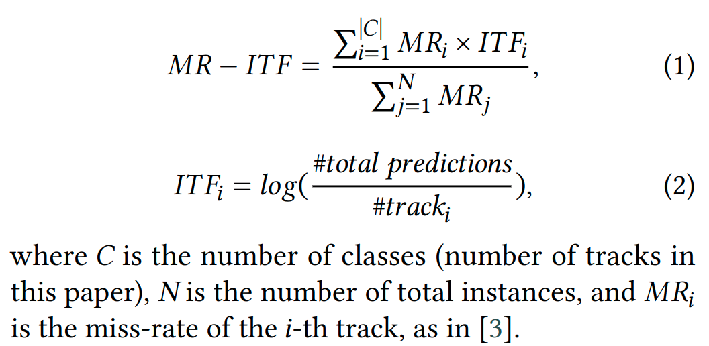

# Track2Vec - Fairness Music Recommendation with a GPU-Free Customizable-Driven Framework
This is the submission of team wwweiwei to the [EvalRS Data Challenge](https://github.com/RecList/evalRS-CIKM-2022). 
## Usage
### Setup
- Build environment
    ```
    pip install -r /path/to/requirements.txt
    ```
- Place your `upload.env` in the root folder.

### Run script
```
python submission.py
```
- Notes: Our proposed metric MR-ITF will automatically report in the corresponding json file with other standard metric.
## Introduction
- Proposed Framework: Track2Vec

- Proposed Fairness Metric: Miss Rate - Inverse Ground Truth Frequency (MR-ITF)

